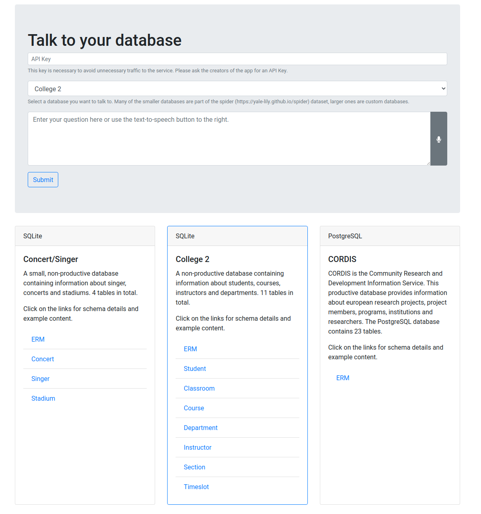

# A Neural Text-to-SQL Architecture Incorporating Values

[https://arxiv.org/abs/2006.00888](https://arxiv.org/abs/2006.00888)

## Abstract

_Building natural language interfaces for databases has been a long-standing challenge for several decades. The major advantage of these so-called text-to-SQL systems is that end-users can query complex databases without the need to know SQL or the underlying database schema. Due to significant advancements in machine learning, the recent focus of research has been on neural networks to tackle this challenge on complex datasets like Spider. Several recent text-to-SQL systems achieve promising results on this dataset. However, none of them extracts and incorporates values from the user questions for generating SQL statements. Thus, the practical use of these systems in a real-world scenario has not been sufficiently demonstrated yet._

_In this paper we propose ValueNet light and ValueNet  -- the first end-to-end text-to-SQL system incorporating values on the challenging Spider dataset. The main idea of our approach is to use not only metadata information about the underlying database but also information on the base data as input for our neural network architecture. In particular, we propose a novel architecture sketch to extract values from a user question and come up with possible value candidates which are not explicitly mentioned in the question. We then use a neural model based on an encoder-decoder architecture to synthesize the SQL query. Finally, we evaluate our model on the Spider challenge using the Execution Accuracy metric, a more difficult metric than used by most participants of the challenge.
Our experimental evaluation demonstrates that ValueNet light and ValueNet reach state-of-the-art results of  64% and 60% accuracy, respectively, for translating from text to SQL, even when applying this more  difficult metric than used by previous work._

## Data
To run this code you need the Spider (https://yale-lily.github.io/spider) data. If you plan to do inference only, you will further need a trained model. 
* Download the _data_ folder from here: https://drive.google.com/drive/folders/1uwrOPFo1D7lh71YrrbgUDkoEcsBAajgc?usp=sharing. It contains both, the raw spider data and the pre-processed data including NER values. You will need at least the pre-processed data (_train.json_ and _dev.json_), the spider schema information (_original/tables.json_) and the SQLite databases (_original/database/_). The easiest way is to just place the full _data_ folder in the root directory.
* trained models: https://drive.google.com/file/d/1hTZ9s-7_NUKRwgjLiR4ZuubwFo0Dca49/view?usp=sharing. You will need to specify the path to this model for the _evaluate_ and _manual_inference_ task.

## Code

_Disclaimer_: this code is largely based on the IRNet (https://github.com/microsoft/IRNet) repository. By now though it has diverted quite a bit from the original code base, therefore we publish it as a non-fork. We thank the IRNet team for their great work, which made this repository possible in the first place.

### Setup
You can either install the script with pip (`pip install -r requirements.txt`) or with pipenv (`pipenv install`). After installing you can run the tasks either from the command line or in PyCharm. To run then im PyCharm, simply import the run configurations from the _.run_ folder.

### You just wanna play around?
Use the manual inference mode, where you specify a database and you can just ask questions. Run `src/manual_inference/manual_inference.py --model_to_load=path/to/trained_model.pt --database=cre_Theme_park`. For all configuration see the `config.py` file.

**IMPORTANT:** the manual inference mode uses Google Entities API for NER (https://cloud.google.com/natural-language/docs/analyzing-entities). You need to organize a valid API key and add it to the `google_api_repository.py` file. The Google API is free up to a certain amount of requests.

### Training
Simply run `python src/main.py`. For all configuration see the `config.py` file. You might wanna increase the batch_size for example.

After each epoch the evaluation task is executed. Evaluation will use the Spider Evaluation script to execute SQL queries on the Spider databases.

