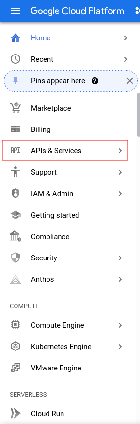
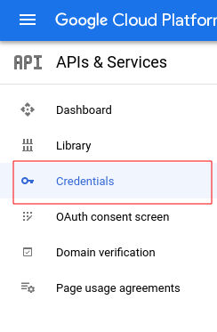
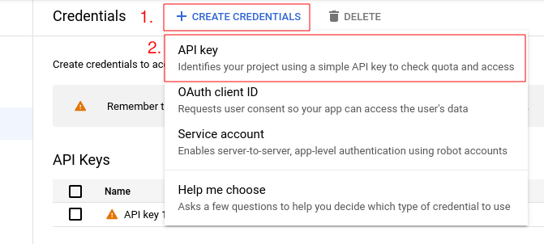

# Hack Zurich Tutorial

Hi there! You can use ValueNet for Text-to-SQL translations in the following ways:

- You just wanna use the deployed **Text-to-SQL API** on the goverment data? Follow the instructions under [Use the deployed API](#use-the-deployed-api) (_easy_)
- You wanna **run the trained Text-to-SQL model locally**, connected to your own data? Follow the instruction under [Local Inference](#local-inference) (_medium, small GPU required_)
- You wanna **re-train the Text-to-SQL model with your own data**, maybe even **improve it**? Follow the instructions under [Train Model](#train-model) (_hard, powerful GPU required_)

## How does ValueNet work under the hood?

ValueNet is a neural network architecture which aims to translate a natural language question into the corresponding SQL query.

Have a look at our paper for the details <https://arxiv.org/abs/2006.00888>

## Use the deployed API

You can use a deployed version of ValueNet via <https://valuenet.cloudlab.zhaw.ch> or <https://inference.hackzurich2021.hack-with-admin.ch> (API only).
This API is working with a deployed postgres database which can be found in [hack_zurich_database.dmp](data/hack_zurich/hack_zurich_database.dmp).

Be aware that you use the model in a **zero-shot** way, so the model has never been fine-tuned on the specific database, but only on the ~200 databases provided in the spider dataset (<https://github.com/taoyds/spider>)

You might play around with the visual client (use the speech to text button) or access the API directly. Make sure to choose the correct database (`hack_zurich`) and the API key `sjNmaCtviYzXWlS`.


Here an example how to use the API wit cURL:

```
curl 'https://valuenet.cloudlab.zhaw.ch/api/question/hack_zurich' \
  -X 'PUT' \
  -H 'X-API-Key: sjNmaCtviYzXWlS' \
  -H 'Content-Type: application/json;charset=UTF-8' \
  --data-raw '{"question":"What is the share of electric cars in 2016 for Wetzikon?", "beam_size": 2}'
```

You will receive a JSON response of the following format, where the actual result is found in `result` and the executed query in `sql`. The array `beams`contains more solution candidates (ordered by the score), but might not be of interest to you.

```json
{
  "beams": [
    [
      "SELECT T1.share_electric_cars FROM share_electric_cars AS T1 JOIN spatialunit AS T2 ON T1.spatialunit_id = T2.spatialunit_id WHERE T2.name = 'Wetzikon' and T1.year = 2016       ",
      8.053660922580296
    ],
    [
      "SELECT T1.share_electric_cars FROM share_electric_cars AS T1 JOIN spatialunit AS T2 ON T1.spatialunit_id = T2.spatialunit_id WHERE T1.year = 2016 and T2.name = 'Wetzikon'       ",
      2.968265109592014
    ]
  ],
  "potential_values_found_in_db": [
    "Wetzikon",
    "2016"
  ],
  "question": "What is the share of electric cars in 2016 for Wetzikon?",
  "question_tokenized": [
    "What",
    "is",
    "the",
    "share",
    "of",
    "electric",
    "cars",
    "in",
    "2016",
    "for",
    "Wetzikon",
    "?"
  ],
  "result": [
    [
      "0.3"
    ]
  ],
  "sem_ql": "Root1(3) Root(3) Sel(0) N(0) A(0) C(28) T(11) Filter(0) Filter(2) A(0) C(12) T(1) V(0) Filter(2) A(0) C(18) T(11) V(1)",
  "sql": "SELECT T1.share_electric_cars FROM share_electric_cars AS T1 JOIN spatialunit AS T2 ON T1.spatialunit_id = T2.spatialunit_id WHERE T2.name = 'Wetzikon' and T1.year = 2016       "
}
```

## Local Inference

To run the trained ValueNet model locally, you have two options:

1. Pull or build the inference docker image and run it, connected to a database running as docker image. Start both database and inference via docker compose from scratch _(easy)_.
2. Pull or build the inference docker image and run it, connected to your local database. Import the database on your existing PostgreSQL server (localhost or wherever you prefer you databases)  _(easy)_.
3. Run the inference API ([manual_inference_api.py](src/manual_inference/manual_inference_api.py)) from your terminal / IDE, connected to your local database _(medium)_.

In both case you need to point the system to a database which contains your data. The easiest way is to install PostgreSQL locally and restore the database dump [hack_zurich_database.dmp](data/hack_zurich/hack_zurich_database.dmp), which contains all necessary data, tables, views and indices.

In case you plan to manipulate the database schema, make sure to also adapt the schema-file which is used by ValueNet at inference time ([tables.json](data/hack_zurich/original/tables.json)). This file contains a high level schema of the database (some tables might be abstracted by simple views) and is the foundation on which ValueNet is synthesizing a query.

After you adapted the schema file, make sure to re-build your docker image as the schema file is built in (see [build_inference_docker.sh](docker/build_inference_docker.sh))

### 1. _(recommended)_ Run inference & database docker image with docker-compose. You can use the pre-built image or build your own

#### Setup a Google API token for Google Natural Language API

The Valuenet API depends on Google API. Make sure your account has a valid API token to use. Otherwise, use the following procedure to generate an API token:

1. Go on <https://console.cloud.google.com> (login with your personal Google account or create one if you don't have any)
2. Open the *APIs and Services* menu
3. Open the *Credentials* menu
4. Select *CREATE CREDENTIALS* and *API key*
5. Copy and paste the API key in the `docker-compose.yml` file's [`NER_API_SECRET` variable](https://github.com/groovytron/valuenet/blob/513931db8cbca7d1fa2a17f691528e58b183b647/docker-compose.yml)

**Please note that you need a valid credit card to enable the Google API and generate a token. It seems like prepaid credit cards are not accepted. Google say that you won't be charged automatically so you should not worry about being billed.**

Here are some screenshots to help you find the menus in the Google console interface.







#### Configure nvidia driver with Docker

To get the infrastructure working with `docker-compose`, you need to have your nvidia working with Docker. To get it working make sure:

- you have installed the nvidia driver for your nvidia GPU
- your driver is loaded (run `nvidia-smi` and you're all good if no error is shown)
- you have installed [nvidia container toolkit](https://docs.nvidia.com/datacenter/cloud-native/container-toolkit/install-guide.html)
- you have installed `nvidia container runtime` (a package should be available for your Linux distribution)
    - Archlinux example: <https://wiki.archlinux.org/title/docker#Run_GPU_accelerated_Docker_containers_with_NVIDIA_GPUs>
- you can run `docker run --gpus all nvidia/cuda:11.3.0-runtime-ubuntu20.04 nvidia-smi` without any error

**You need to reboot your system after installing nvidia drivers. You also need to restart the docker service after installing the nvidia container toolkit and nvidia container runtime.**
Docker service can be restarted by running `sudo systemctl restart docker` (or `sudo service docker restart`).

To make sure docker can access nvidia runtime when using docker-compose make sure the following is in `/etc/docker/daemon.json`:

```json
{
  "runtimes": {
    "nvidia": {
      "path": "/usr/bin/nvidia-container-runtime",
      "runtimeArgs": []
    }
  }
}
```

**Please note that the path to `nvidia-container-runtime` might differ from one distribution to another. Use `which nvidia-container-runtime` to figure out its path and update the `daemon.json` accordingly to your configuration.**

**Docker service needs to be restarted after editing this file.**

#### Start the stack

Run `docker-compose up` in a terminal in the project's root folder to start the stack locally.

To import the data run `docker-compose exec postgres sh -c 'psql --dbname=hack_zurich --username=hack_zurich --password < /var/dumps/2021-09-20-hack_zurich.sql'`. It will prompt you for the password (which is `hack_zurich`). Just input the password and hit Enter to start the import.

The API should now be working. And the following services should be accessible:

- PostgreSQL on `localhost:5432`
    - username: `hack_zurich`
    - password: `hack_zurich`
    - database: `hack_zurich`
- [Adminer](https://www.adminer.org/) on <http://localhost:8080>. Use the following to connect to the database:
    - System: `PostgreSQL`
    - Server: `postgres`
    - Username: `hack_zurich`
    - Password: `hack_zurich`
    - Database: `hack_zurich`
- Valuenet API on <http://localhost:5000>

To test the API, just run the following command:

```console
curl 'http://localhost:5000/api/question/hack_zurich' \
  -X 'PUT' \
  -H 'X-API-Key: sjNmaCtviYzXWlS' \
  -H 'Content-Type: application/json;charset=UTF-8' \
  --data-raw '{"question":"What is the share of electric cars in 2016 for Wetzikon?", "beam_size": 2}' 
```

To stop the stack either presse Ctrl-C in the terminal running the stack or just run `docker-compose stop` in the project's root folder.

### 2. Run inference docker image (pre-built or adapted by you) with an existing PostgreSQL database

The docker image used in this case is [Dockerfile](docker/inference/Dockerfile). You can pull the pre-built image from <https://hub.docker.com/r/ursinbrunner/valuenet-inference-hack-zurich>.

```
docker pull ursinbrunner/valuenet-inference-hack-zurich:1.0
```

To run the docker image make sure a **NVIDIA GPU** is available (either on your notebook or in the cloud you prefer) and your Docker environment supports GPUs. To do so, you might follow the official nvidia guide: <https://docs.nvidia.com/datacenter/cloud-native/container-toolkit/overview.html>

To run the docker image use the following command. You might wanna change the **database connection** to point to your database. To do so override the environment variables, as seen in the following example.

The two non-database specific parameters you need to specify are **API_KEY** and **NER_API_SECRET**. API_KEY you can choose as you please - just make sure you use the same in your API requests. NER API Secret is a Google API key which is used to do NER on the natural language question, with the goal to extract potential values (e.g. _Wetzikon_ in the example above). You can get your own API key here <https://cloud.google.com/natural-language/docs/analyzing-entities> or ask us during the hack for a key.

```
docker run --gpus all -e API_KEY=api_key_you_plan_to_use -e DB_USER=postgres -e DB_PW=your_secret_db_password -e DB_HOST=localhost -e DB_PORT=5432 -e NER_API_SECRET=your_google_ner_api_key -p 5000:5000 --network="host" ursinbrunner/valuenet-inference-hack-zurich:1.0
```

The parameter `--network="host"` is only necessary if you run the database on the docker host system.

#### Adapt docker image

You might have to adapt the inference docker image, if for example you adapt the database schema file. To do so, have a look at the docker file itself [Dockerfile](docker/inference/Dockerfile) and use/adapt the build script ([build_inference_docker.sh](docker/build_inference_docker.sh))

### 3. Run inference API locally

In case you plan to modify/re-train the model, might as well setup the project environment and run the inference locally via [manual_inference_api.py](src/manual_inference/manual_inference_api.py) script.

To do so, follow the environment setup described in [Environment Setup](#environment-setup) and run [manual_inference_api.py](src/manual_inference/manual_inference_api.py). Specify command line parameters as seen in the inference [Dockerfile](docker/inference/Dockerfile) to point to your database.

As a pre-trained model, use <https://github.com/brunnurs/valuenet/releases/tag/trained_model>

## Train Model

Training/fine-tuning the model on custom data or even improving the model with new approaches is definitely the most interesting part. It is though also the most challenging one, so don't give up easily!

Follow the steps in the given order:

1. Environment Setup _(medium)_
2. Prepare & Preprocess Data _(medium)_
3. Train Model _(easy, but requires time & hardware)_

### 1\. Environment Setup

_Caution: this projects has so far only been used on a Linux or macOS environment. It will most probably also work under windows, but you might have to adapt the setup slightly._

To train the large transformer model, you require a relatively powerful GPU. While inference will already work on a decent Notebook GPU with >= 4GB GPU Memory, training the model (even with small batch sizes) will require at least 12GB of GPU memory, 24GB are preferable. The easiest way to get such a hardware is to rent it temporary, have a look for example at the AWS P2/P3 line (<https://aws.amazon.com/ec2/instance-types/p3/>). We use a classical NVIDIA/CUDA/PyTorch stack for training the model. You find a good guide how to set up this stack here: <https://pytorch.org/get-started/locally/>.

#### Local setup

Setup the NVIDIA/CUDA/PyTorch stack as described. To test if you can access the GPU, run the [src/tools/is_cuda_working.py](is_cuda_working.py) script. Then install dependencies with the virtual environment tool of your choice. If you use vanilla `pip`, use the <requirements.txt> file. If you prefer `pipenv`, use <Pipfile> and <Pipfile.lock>.

#### Setup with docker

An alternative to a local setup is training inside a designated docker environment. This is especially useful if your training runs somewhere in a cloud environment. Use the Dockerfile (<docker/train/Dockerfile>) and adapt `authorized_keys` and `know_hosts` files with your credentials, so you can SSH into the docker container during training. Be aware that the Dockerfile contains all dependencies for training, not though for pre-processing. You might have to add some dependencies if you use the docker environment to exectute the pre-processing.

Be aware that also this docker needs to be started with GPU support.

### 2\. Prepare & Preprocess Data

Preparing and preprocessing your data might take most of your time. We first need to bring your custom data into the Spider format (<https://github.com/taoyds/spider>), before we do more advanced pre-processing and Named Entity Recognition.

#### Add your custom data

Add your custom data to [handmade_data_train.json](data/hack_zurich/handmade_training_data/handmade_data_train.json) and [handmade_data_dev.json](data/hack_zurich/handmade_training_data/handmade_data_dev.json). You see in both files one sample how to do so. Add both the SQL and the natural language representation for a question.

How do you come up with custom training data for your database is up to you. You might write all question/SQL pairs manually, or you might find a smart way to generate large amounts of training data (e.g. by using a template approach)

Be aware that not the full SQL Syntax is supported. A table alias for example needs to be specified as `table_a as a` and not `table_a a`. Further all joins need to be written in the form `table_a as a join table_b as b on a.id_b = b.id`, so no inner/left/right join specification is allowed. You might stumble over more details, but you can always take the spider dataset as orientation on how to write the SQL.

After you added your data (both _TRAIN_ and _TEST_ split), run the [training_data_builder.py](src/tools/training_data_builder/training_data_builder.py). It will take your custom data and transform it into the Spider representation:

```bash
PYTHONPATH=$(pwd)/src python src/tools/training_data_builder/training_data_builder.py --data hack_zurich
```

You will now find your custom data in the two files <data/hack_zurich/original/train.json> and <data/hack_zurich/original/dev.json>.

#### Extract Value Candidates using Named Entity Recognition

In this step we try to extract potential _values_ from the natural language question. In the example _'What is the share of electric cars in 2016 for Wetzikon?'_, we would like to identify _2016_ and _Wetzikon_ as value candidates.

To do so we use a mix of Named Entity Recognition (NER) and heuristics. As NER engine we use the Google Natural Language API. You can get your own API key here <https://cloud.google.com/natural-language/docs/analyzing-entities> or ask us during the hack for a key.

Run the script twice, for both _TRAIN_ and _DEV_ split:

```bash
PYTHONPATH=$(pwd)/src python src/named_entity_recognition/api_ner/extract_values.py --data_path=data/hack_zurich/original/train.json --output_path=data/hack_zurich/ner_train.json --ner_api_secret=GOOGLE_API_SECRET
PYTHONPATH=$(pwd)/src python src/named_entity_recognition/api_ner/extract_values.py --data_path=data/hack_zurich/original/dev.json --output_path=data/hack_zurich/ner_dev.json --ner_api_secret=GOOGLE_API_SECRET
```

We then also extract the ground truth values from the SQL query. Doing this we can verify if our NER approach returns the values required to synthesize the query successfully.

```bash
PYTHONPATH=$(pwd)/src python src/tools/get_values_from_sql.py --data_path data/hack_zurich/original/train.json --table_path data/hack_zurich/original/tables.json --ner_path data/hack_zurich/ner_train.json
PYTHONPATH=$(pwd)/src python src/tools/get_values_from_sql.py --data_path data/hack_zurich/original/dev.json --table_path data/hack_zurich/original/tables.json --ner_path data/hack_zurich/ner_dev.json
```

This last script doesn't create a new file, but adds the ground truth values to the _ner_dev.json_ and _ner_train.json_ files, see the new attribute _values_:

```json
"values": [
      "Wetzikon",
      "2016"
    ]
```

#### Pre-processing

The next step is the actual pre-processing. This step contains classical NLP pre-processing, but mostly it's focusing on encoding the DB-schema and values in a way the model can learn from it. As an example we will go through the content of the database and create so called _value hints_, so marking a column if it contains a value we extracted during the last step via NER.

This step is highly parallelized, but might take time if your database is large or you have large amounts of training data.

To execute, run the following script (once for _DEV_, once for _TRAIN_):

```bash
PYTHONPATH=$(pwd)/src python src/preprocessing/pre_process.py --data_path=data/hack_zurich/original/train.json --ner_data_path=data/hack_zurich/ner_train.json --table_path=data/hack_zurich/original/tables.json --output=data/hack_zurich/preprocessed_train.json --database_host=your_database_host --database_port=5432 --database_user=postgres --database_password=DB_PW --database_schema=public
PYTHONPATH=$(pwd)/src python src/preprocessing/pre_process.py --data_path=data/hack_zurich/original/dev.json --ner_data_path=data/hack_zurich/ner_dev.json --table_path=data/hack_zurich/original/tables.json --output=data/hack_zurich/preprocessed_dev.json --database_host=your_database_host --database_port=5432 --database_user=postgres --database_password=DB_PW --database_schema=public
```

#### Modelling JOINs and SQL-to-SemQL

In this last step we model some special JOINs situation as filters and then transform each SQL statement to a SemQL (Semantic Query Language) AST (abstract syntax tree).

The idea train the model on an intermediate query representation (SemQL) instead of pure SQL stems from the [IRNet paper](https://arxiv.org/pdf/1905.08205.pdf) with the goal to abstract implementation details of SQL (e.g. the difference between _WHERE_ and _HAVING_).

ValueNet will at inference time transform the SemQL representation back to classical SQL.

We start by modeling some JOINs as filters **(minor importance, has most probably no effect on your data - you might skip it)**

```bash
PYTHONPATH=$(pwd)/src python src/preprocessing/model_joins_as_filter.py --data_path=data/hack_zurich/preprocessed_train.json --table_path=data/hack_zurich/original/tables.json --output=data/hack_zurich/preprocessed_with_joins_train.json 
PYTHONPATH=$(pwd)/src python src/preprocessing/model_joins_as_filter.py --data_path=data/hack_zurich/preprocessed_dev.json --table_path=data/hack_zurich/original/tables.json --output=data/hack_zurich/preprocessed_with_joins_dev.json
```

And then transform SQL to SemQL:

```bash
PYTHONPATH=$(pwd)/src python src/preprocessing/sql2SemQL.py --data_path data/hack_zurich/preprocessed_with_joins_train.json --table_path data/hack_zurich/original/tables.json --output data/hack_zurich/train.json 
 PYTHONPATH=$(pwd)/src python src/preprocessing/sql2SemQL.py --data_path data/hack_zurich/preprocessed_with_joins_dev.json --table_path data/hack_zurich/original/tables.json --output data/hack_zurich/dev.json
```

With this script, the pre-processing is done. The files `train.json` and `dev.json` are gonna be the input for training the neural network in the next chapter.

### 3\. Train Model

Now that we have the environment ready and the custom data prepared, we want to train or fine-tune the model. There are multiple ways to train a model on custom data, we will go into depth for two of them.

#### Train Model on Spider and Custom Data combined

This is the simplest approach: put your custom data together with the large training data from Spider and train the model from scratch (with exception of the transformer encoder, which is already pre-trained).

The idea here is to train the model on the general task of NL-to-SQL by using the large number of samples from Spider, but still teaching it insights of your specific database by adding your custom data.

To do so merge your custom data (most probably [data/hack_zurich/train.json](data/hack_zurich/dev.json)) with the training data from Spider (you find them here, already pre-processed: [data/spider/train.json](data/spider/train.json)). Do the same for the *DEV* split and run the training.
For training define your data folder with `--data_set`. So if your combined data is located in `data/spider`, define `--data_set spider`.

Be aware that you also need to combine the schema definitions which you find in `data/hack_zurich/original/tables.json` and `data/spider/original/tables.json`, as the training algorithm expects one file with all schema definitions.
Put then the combined file in the `original` folder of your data, so e.g. `data/spider/original/tables.json` if you use `spider` as the folder for your combined data.

Now you can start the training:

```bash
python src/main.py --exp_name experiment_name_you_choose --data_set spider --cuda --batch_size 8 --num_epochs 100 --loss_epoch_threshold 70 --sketch_loss_weight 1.0 --beam_size 1 --seed 90
```

The main script will initialize the training loop and evaluate your model on the dev split after each epoch. Be aware that there are plenty more parameters to configure the training, see <src/config.py> for all potential parameters. If you run into trouble with not enough GPU memory, try reducing batch-size.

We use [Weights & Biases]((https://wandb.ai/site)) for experiment tracking. The easiest way for you is to also get an account, create a project and login (<https://docs.wandb.ai/ref/cli/wandb-login>) before starting the training. Alternatively you can also remove the `wandb` commands and use for example tensorboard to log the metrics in a simple way.

You can expect the model to be decent after 5 epochs. Best results (~ +3% accuracy) we usually achieve after ~70 epochs.

With the configuration above, a training/dev set of ~8000 samples and 100 epochs, **the training takes ~26h on a NVidia Tesla V100 (32GB)**. For **5 epochs, it would therefore take ~1.3h.**

#### Fine-tune a pre-trained model on your custom data

An alternative to re-train the model from scratch is to fine-tune a pre-trained model. To do so, we only train on the custom data. Fine-tuning a pre-trained model works usually best by freezing the parameters of large parts of the model and only train the remaining parameters, using a low learning rate. You might even add new layers to the neural network and train this additional parts of the neural network while freezing most of the pre-trained model.

You find a pre-trained model here: <https://github.com/brunnurs/valuenet/releases/tag/trained_model>
